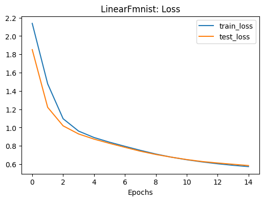
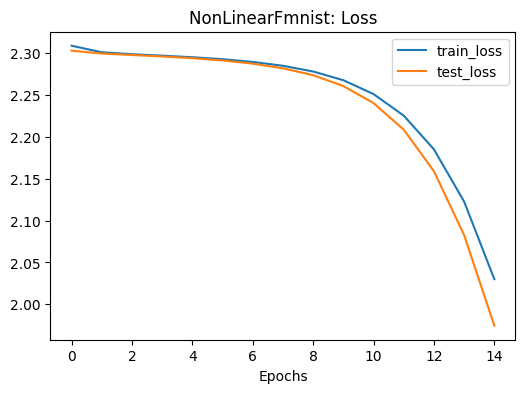
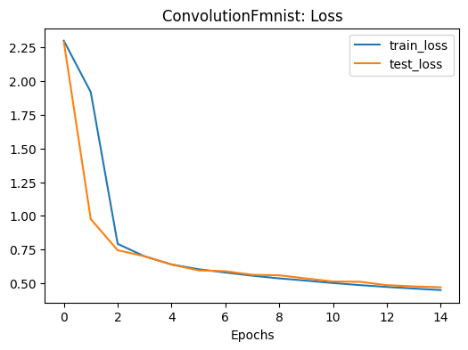

# Experiments with Fashion-MNIST Dataset

This repository is focused on training different models on Fashion-MNIST dataset. There will be three different models which will be trained, tested and compared on this dataset. The three models chosen will be the three different deep learning techniques a beginner would learn at the start of their 'deep-learning-journey' and this is because Fashion-MNIST is a beginner dataset.

The Fashion-MNIST dataset, consisting of grayscale images of 10 different types of clothing, is often used as a benchmark for testing machine learning models, particularly for beginners. It serves as a simpler alternative to the original MNIST dataset, which contains hand-written digits, and is a good choice for experimenting with image classification models.

The three models for experimentation:
- **Linear Model**: This model will just have dense linear layers with no activation functions. Focuses on basic linear transformations, suitable for learning simple relationships.
- **Non-Linear Model**: This model will combine the dense linear layers with non-linear activation functions to provide the model with the ability to learn non-linear patterns in data.
- **Convolutional Model**: This model will use a convolutional neural network with pooling. Utilizes convolutional layers to capture spatial features in the image, which has proven to be highly effective for image classification tasks. This model will replicate the Tiny-VGG model that has been visually demonstrated [here]('https://poloclub.github.io/cnn-explainer/').

## Requirements

- Ubuntu (Only tested on Ubuntu)
- PyTorch >= 2.5.1
- Torchvision >= 0.20.1
- Torchinfo >= 1.8.0S
- Torchmetrics >= 1.5.2

```
pip install -r requirements.txt
```

## Usage

Train all three models by running the `train.py` script.

The hyperparameters can be altered at the top of the `train.py` file.

```
python train.py
```

## Results

    Models trained on:
    - Epochs: 15
    - Learning Rate: 1e-3
    - Batch Size: 32

The models were trained for 15 epochs, and performance was evaluated on the test set after training per epoch. The loss values were monitored throughout training, and visualized loss curves for each model are provided below. Additionally, accuracy was chosen as the primary evaluation metric due to its simplicity and relevance for image classification tasks with a balanced dataset. All the models approximately had same number of parameters which is ~13,000. 

The convolutional model was the best performing model out of all three whereas the second best model was the linear model. The model with the non-linear activations had the worst performance.

### Accuracy on test data:
- Linear Model: 79% 
- Non-Linear Model: 45%
- Convolutional Model: 83%

## Loss Curves

From the loss curves, it's evident that the Convolutional Model achieved a steady decrease in both training and testing loss, indicating it was learning efficiently and generalizing well to the test set. In contrast, the Non-Linear Model had a high training and testing loss, signaling that it might have struggled to learn meaningful patterns. The Linear Model also shows a relatively stable loss, which is consistent with its better-than-expected accuracy.

The loss values after the training:
- **Linear Model**: 
    - *Training*: 0.57
    - *Testing*: 0.59
- **Non-Linear Model**: 
    - *Training*: 2.03
    - *Testing*: 1.97
- **Convolutional Model**: 
    - *Training*: 0.45
    - *Testing*: 0.47

Linear Model                                                | Non-Linear Model                                                | Convolutional Model                                                 |
:----------------------------------------------------------:|:---------------------------------------------------------------:|:-------------------------------------------------------------------:|
  || |

## Observations

- **Convolutional Model Outperforms All Others**: The convolutional model achieved the highest test accuracy at 83%, which aligns with common knowledge in deep learning: convolutional neural networks (CNNs) excel in image-based tasks due to their ability to capture spatial hierarchies and local features. This shows the power of using CNNs for image classification, even with a relatively simple dataset like Fashion-MNIST.

- **Linear Model's Surprising Performance**: The linear model achieved 79% accuracy, outperforming the non-linear model. Despite its simplicity, the linear architecture was able to capture some meaningful features from the Fashion-MNIST dataset, potentially due to the dataset's relatively straightforward nature. This result suggests that for certain simple datasets, non-linearity may not be necessary for achieving decent performance.

- **Non-Linear Model's Underperformance**: The non-linear model, with its activation functions, resulted in the worst performance (45% accuracy). It is possible that the Fashion-MNIST dataset, being relatively simple, may not require non-linearity to perform well. This may possibly be due to the frequently occuring linearity in clothing with classes such as shirt, t-shirts, pants, bags etc.